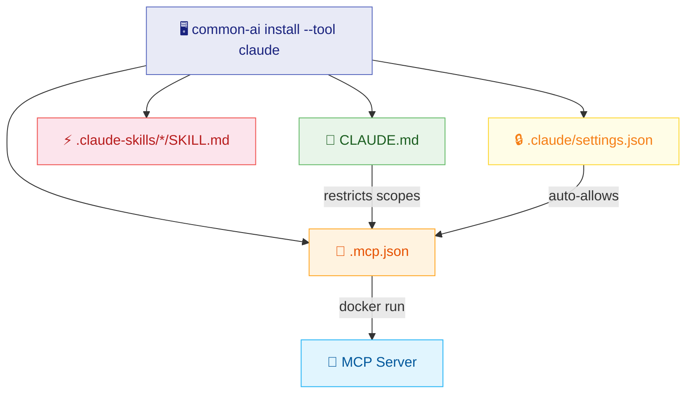

# :material-cloud: Claude Code

Claude Code reads project-level configuration from the workspace root. Skills are installed as standalone directories under `.claude-skills/`, and knowledge bases are accessed via the MCP server (Docker image with baked-in data).

## :material-graph: Generated Files



## :material-folder-open: Directory Layout

```text
~/projects/my-project/
├── 📄 .mcp.json
├── 📁 .claude/
│   └── 📄 settings.json
├── 📁 .claude-skills/
│   ├── 📁 commit/
│   │   └── 📄 SKILL.md
│   ├── 📁 push/
│   │   └── 📄 SKILL.md
│   └── 📁 code-review/
│       └── 📄 SKILL.md
└── 📝 CLAUDE.md
```

## :material-file-cog: Generated Configuration

=== ":material-connection: .mcp.json"

    Defines the MCP server that provides knowledge base search:

    ```json
    {
      "mcpServers": {
        "common-knowledge-base-mcp": {
          "command": "docker",
          "args": ["run", "-i", "--rm",
            "ghcr.io/jlmonteiro/common-knowledge-base-mcp:latest"]
        }
      }
    }
    ```

=== ":material-shield-lock: .claude/settings.json"

    Auto-approves MCP tool calls so the agent doesn't prompt for permission:

    ```json
    {
      "allowedTools": ["common-knowledge-base-mcp:*"]
    }
    ```

=== ":material-text-box: CLAUDE.md"

    Slim prompt defining persona and restricting KB scopes:

    ```markdown
    # java-dev

    ## Role
    You are a senior developer specializing in [YOUR DOMAIN HERE].

    ## Knowledge Bases
    Use the MCP server to search these knowledge bases.
    Only use the following scopes (pass them in the `scopes` parameter):
    - **git** — git conventions and standards
    - **java** — java conventions and standards

    **Important:** Do NOT search scopes outside this list.
    ```

## :material-lightning-bolt: Skills Behavior

!!! info "Progressive Loading"

    Each skill in `.claude-skills/` is a standalone directory with a `SKILL.md` file:

    1. :material-magnify: **Discovery** — Claude reads frontmatter (name + description) at session start
    2. :material-download: **Activation** — Full instructions load only when triggered
    3. :material-slash-forward: **Slash commands** — Each skill becomes `/skill-name` (e.g., `/commit`, `/code-review`)

## :material-lightbulb: Rationale

!!! abstract "Design Decisions"

    | Decision | Why |
    |----------|-----|
    | KBs in Docker image | No local files needed — portable across machines and CI |
    | Scope restriction in prompt | MCP serves all scopes; prompt limits which ones the agent uses |
    | `.mcp.json` at root | Claude Code's native project-level MCP discovery |
    | `.claude/settings.json` | Avoids interactive permission prompts for MCP tools |
    | `.claude-skills/` directory | Claude Code's native skill discovery path |
    | Slim `CLAUDE.md` | Skills handle complex workflows; prompt stays focused on persona |

## :material-console: Examples

=== ":material-star: Full Java Developer"

    ```bash
    common-ai install --tool claude --name java-dev \
      --target ~/projects/my-java-app \
      --skills git/commit --skills git/push --skills git/create-pr \
      --skills development/code-review --skills development/create-test \
      --knowledge-bases git --knowledge-bases java --knowledge-bases api
    ```

=== ":material-git: Minimal Git Workflow"

    ```bash
    common-ai install --tool claude --name git-helper \
      --target ~/projects/my-app \
      --skills git/commit --skills git/push \
      --knowledge-bases git
    ```

=== ":material-infinity: All Resources"

    ```bash
    common-ai install --tool claude --name full-dev \
      --target ~/projects/my-app
    ```

=== ":material-eye: Dry Run"

    ```bash
    common-ai install --tool claude --name java-dev \
      --target ~/projects/my-app \
      --skills git/commit --knowledge-bases git \
      --dry-run
    ```

## :material-check-circle: Verification

After installing, open your terminal in the project directory:

```bash
cd ~/projects/my-app
claude
```

!!! success "Verify MCP connection"

    Inside the Claude prompt, type:

    ```
    /mcp
    ```

    Claude Code will launch the Docker container and display the active `stdio` link.

!!! example "Test a skill"

    ```
    /commit
    ```

    Claude loads the commit skill instructions and executes the workflow.
