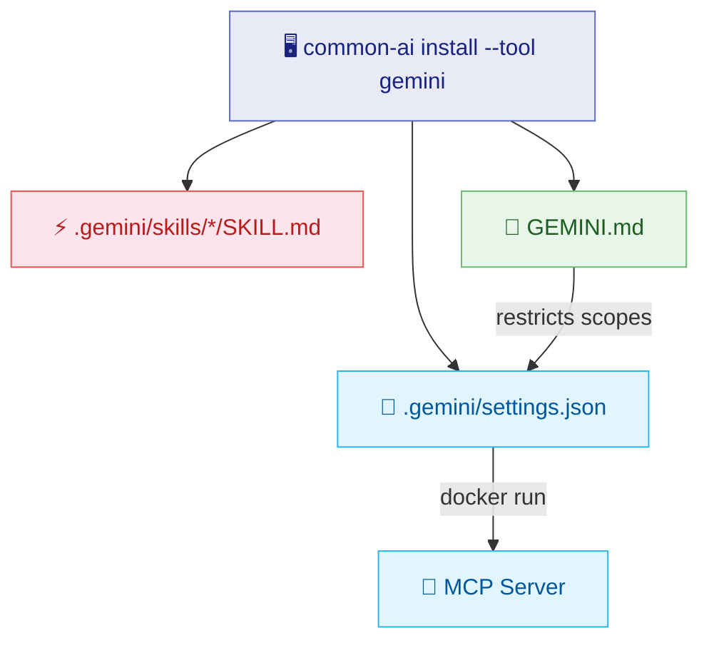

# :material-diamond-stone: Gemini CLI

Gemini CLI reads project configuration from a `.gemini/` directory in the workspace root. Skills live under `.gemini/skills/`, and knowledge bases are accessed via the MCP server (Docker image with baked-in data).

## :material-graph: Generated Files



## :material-folder-open: Directory Layout

```text
~/projects/my-project/
├── 📁 .gemini/
│   ├── 📄 settings.json
│   └── 📁 skills/
│       ├── 📁 commit/
│       │   └── 📄 SKILL.md
│       ├── 📁 push/
│       │   └── 📄 SKILL.md
│       └── 📁 code-review/
│           └── 📄 SKILL.md
└── 📝 GEMINI.md
```

## :material-file-cog: Generated Configuration

=== ":material-connection: .gemini/settings.json"

    Defines the MCP server that provides knowledge base search:

    ```json
    {
      "mcpServers": {
        "common-knowledge-base-mcp": {
          "command": "docker",
          "args": ["run", "-i", "--rm",
            "ghcr.io/jlmonteiro/common-knowledge-base-mcp:latest"]
        }
      }
    }
    ```

=== ":material-text-box: GEMINI.md"

    Slim prompt defining persona and restricting KB scopes:

    ```markdown
    # java-dev

    ## Role
    You are a senior developer specializing in [YOUR DOMAIN HERE].

    ## Knowledge Bases
    Use the MCP server to search these knowledge bases.
    Only use the following scopes (pass them in the `scopes` parameter):
    - **git** — git conventions and standards
    - **java** — java conventions and standards

    **Important:** Do NOT search scopes outside this list.
    ```

## :material-lightning-bolt: Skills Behavior

!!! info "Automatic Activation"

    Each skill in `.gemini/skills/` is a standalone directory with a `SKILL.md` file:

    1. :material-magnify: **Discovery** — Gemini caches frontmatter (name + description) at session start
    2. :material-download: **Activation** — Full instructions load when user's request matches the description
    3. :material-auto-fix: **Transparent** — No slash commands needed; activation is automatic

## :material-lightbulb: Rationale

!!! abstract "Design Decisions"

    | Decision | Why |
    |----------|-----|
    | KBs in Docker image | No local files needed — portable across machines |
    | Scope restriction in prompt | MCP serves all scopes; prompt limits which ones the agent uses |
    | `.gemini/settings.json` | Gemini CLI's native project-level settings location |
    | Skills inside `.gemini/skills/` | Gemini CLI's native skill discovery path |
    | Slim `GEMINI.md` | Skills handle complex workflows; prompt stays focused on persona |

## :material-earth: Project vs Global Scope

| Scope | Target | Use Case |
|-------|--------|----------|
| :material-folder: Project | `~/projects/my-app` | Team-shared conventions for a specific repo |
| :material-home: Global | `~` | Personal defaults across all projects |

!!! note "Project settings override global"
    If both exist, Gemini merges them with project-level taking precedence.

## :material-console: Examples

=== ":material-star: Full Java Developer"

    ```bash
    common-ai install --tool gemini --name java-dev \
      --target ~/projects/my-java-app \
      --skills git/commit --skills git/push --skills git/create-pr \
      --skills development/code-review --skills development/create-test \
      --knowledge-bases git --knowledge-bases java --knowledge-bases api
    ```

=== ":material-git: Minimal Git Workflow"

    ```bash
    common-ai install --tool gemini --name git-helper \
      --target ~/projects/my-app \
      --skills git/commit --skills git/push \
      --knowledge-bases git
    ```

=== ":material-infinity: All Resources"

    ```bash
    common-ai install --tool gemini --name full-dev \
      --target ~/projects/my-app
    ```

=== ":material-home: Global Configuration"

    Install globally so Gemini uses these resources in any project:

    ```bash
    common-ai install --tool gemini --name dev \
      --target ~ \
      --skills git/commit --skills git/push \
      --knowledge-bases git
    ```

    Creates `~/.gemini/settings.json` and `~/GEMINI.md`.

=== ":material-eye: Dry Run"

    ```bash
    common-ai install --tool gemini --name java-dev \
      --target ~/projects/my-app \
      --skills git/commit --knowledge-bases git \
      --dry-run
    ```

## :material-check-circle: Verification

After installing, open your terminal in the project directory:

```bash
cd ~/projects/my-app
gemini
```

!!! example "Test by triggering a skill"

    > "commit my changes"

    Gemini matches the request to the `commit` skill description, loads the full instructions, and executes the workflow.
