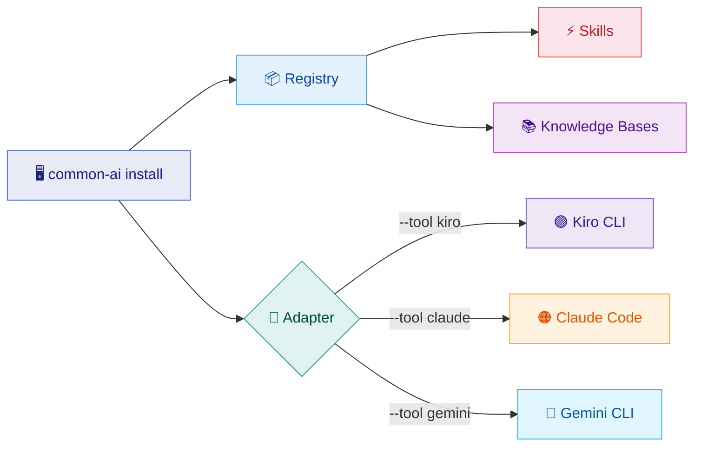
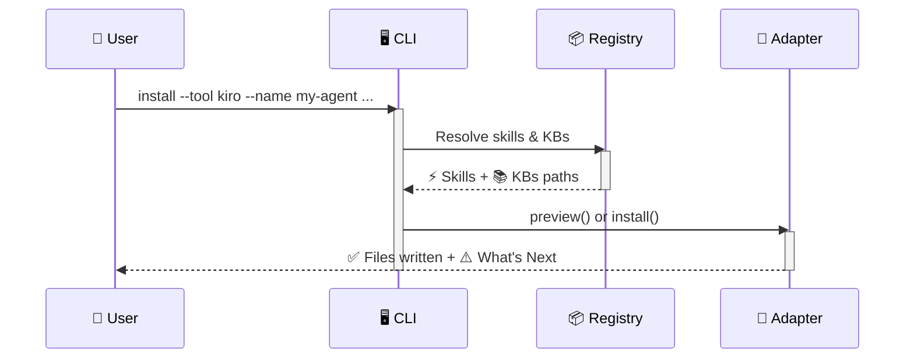

# :material-console: CLI

The `common-ai` CLI installs shared skills and knowledge bases into any supported AI tool with a single command. It generates the correct file layout, configuration, and agent prompt for each tool automatically.

## :material-sitemap: Architecture



## :material-cog-sync: How It Works



1. **Registry** discovers all available skills and knowledge bases from the `resources/` directory
2. **Adapter** transforms them into the target tool's native format
3. **Output** shows what was installed and what to customize next

## :material-download: Installation

=== ":material-package-variant: pipx (recommended)"

    ```bash
    # Install globally (isolated environment, no venv needed)
    pipx install git+https://github.com/jlmonteiro/common-ai-resources.git

    # Pin to a specific version
    pipx install git+https://github.com/jlmonteiro/common-ai-resources.git@v0.5.0

    # Upgrade to latest
    pipx upgrade common-ai-resources
    ```

=== ":material-language-python: pip"

    ```bash
    pip install git+https://github.com/jlmonteiro/common-ai-resources.git
    ```

=== ":material-code-braces: Development"

    ```bash
    git clone https://github.com/jlmonteiro/common-ai-resources.git
    cd common-ai-resources
    python -m venv .venv && source .venv/bin/activate
    pip install -e ".[dev]"
    ```

!!! tip "Verify installation"
    ```bash
    common-ai --help
    ```

## :material-tools: Supported Tools

<div class="grid cards" markdown>

-   :material-robot:{ .lg .middle } **Kiro CLI**

    ---

    Native skills, local KB indexing, agent JSON configuration.

    [:octicons-arrow-right-24: Kiro CLI](kiro.md)

-   :material-cloud:{ .lg .middle } **Claude Code**

    ---

    `.claude-skills/`, MCP via Docker, `.mcp.json` at project root.

    [:octicons-arrow-right-24: Claude Code](claude.md)

-   :material-diamond-stone:{ .lg .middle } **Gemini CLI**

    ---

    `.gemini/skills/`, MCP via Docker, project or global scope.

    [:octicons-arrow-right-24: Gemini CLI](gemini.md)

</div>

## :material-console-line: Command Reference

### `common-ai install`

```bash
common-ai install \
  --tool <kiro|claude|gemini> \
  --name <agent-name> \
  --target <directory> \
  [--skills <category/name>]... \
  [--knowledge-bases <scope>]... \
  [--dry-run]
```

| Option | Required | Description |
|--------|:--------:|-------------|
| `--tool` | :material-check: | Target AI tool: `kiro`, `claude`, or `gemini` |
| `--name` | :material-check: | Agent name (used in config files and prompts) |
| `--target` | :material-check: | Installation directory |
| `--skills` | | Skills to install (repeatable). Defaults to **all** |
| `--knowledge-bases` | | KB scopes to install (repeatable). Defaults to **all** |
| `--dry-run` | | Preview without writing files |

## :material-select-multiple: Selecting Resources

=== "All resources"

    ```bash
    common-ai install --tool kiro --name dev \
      --target ~/.kiro/agents/dev-resources
    ```

    !!! tip "Omitting `--skills` and `--knowledge-bases` installs everything"

=== "Specific selection"

    ```bash
    common-ai install --tool kiro --name dev \
      --target ~/.kiro/agents/dev-resources \
      --skills git/commit --skills git/push \
      --knowledge-bases git --knowledge-bases java
    ```

=== "Only KBs (no skills)"

    ```bash
    common-ai install --tool claude --name dev \
      --target ~/my-project \
      --knowledge-bases api --knowledge-bases security
    ```

## :material-lightning-bolt: Available Resources

See the full catalog of available resources:

- [:material-star-shooting: Skills](../skills/index.md) — Git workflow, SDD, development, infrastructure, security, and more
- [:material-bookshelf: Knowledge Bases](../knowledge-bases/index.md) — Cross-project conventions and standards

## :material-compare: Tool Comparison

| Feature | :material-robot: Kiro | :material-cloud: Claude | :material-diamond-stone: Gemini |
|---------|------|--------|--------|
| Skills format | Native `SKILL.md` | `.claude-skills/` | `.gemini/skills/` |
| KB access | Local files (indexed) | MCP server (Docker) | MCP server (Docker) |
| Scope filtering | Agent JSON (per-KB) | Prompt instruction | Prompt instruction |
| Config file | `agent.json` | `.mcp.json` + `.claude/settings.json` | `.gemini/settings.json` |
| Prompt file | `prompt.md` | `CLAUDE.md` | `GEMINI.md` |

## :material-eye: Dry Run

!!! info "Always preview before installing"

    ```bash
    common-ai install --tool kiro --name java-dev \
      --target ~/.kiro/agents/java-dev-resources \
      --skills git/commit --knowledge-bases git --knowledge-bases java \
      --dry-run
    ```

The dry run shows:

- :material-file-document: Generated configuration files (with full content)
- :material-file-tree: Target directory structure
- :material-counter: Summary of what would be installed
