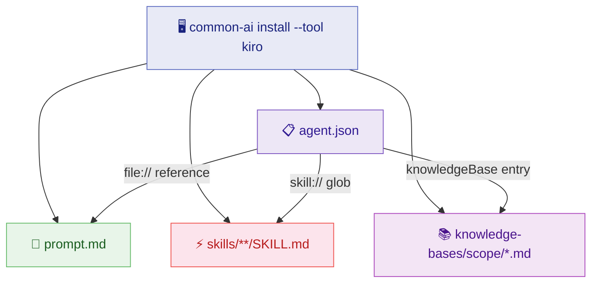

# :material-robot: Kiro CLI

Kiro CLI is the primary target for this project. It supports native skills (progressive loading via `SKILL.md`), knowledge bases (semantic search with RAG), and agent configuration via JSON.

## :material-graph: Generated Files



## :material-folder-open: Directory Layout

```text
~/.kiro/agents/
├── 📋 java-dev-agent.json
└── 📁 java-dev-resources/
    ├── 📝 prompt.md
    ├── 📁 skills/
    │   ├── 📁 git/
    │   │   ├── 📁 commit/
    │   │   │   └── 📄 SKILL.md
    │   │   └── 📁 push/
    │   │       └── 📄 SKILL.md
    │   └── 📁 development/
    │       └── 📁 code-review/
    │           └── 📄 SKILL.md
    └── 📁 knowledge-bases/
        ├── 📁 git/
        │   ├── 📄 branching.md
        │   ├── 📄 commit-messages.md
        │   └── 📄 ...
        └── 📁 java/
            ├── 📄 spring-boot.md
            ├── 📄 testing.md
            └── 📄 ...
```

## :material-file-cog: Generated Configuration

=== ":material-code-json: agent.json"

    ```json
    {
      "name": "java-dev",
      "resources": [
        "file:///Users/you/.kiro/agents/java-dev-resources/prompt.md",
        "skill:///Users/you/.kiro/agents/java-dev-resources/skills/**/SKILL.md",
        {
          "type": "knowledgeBase",
          "name": "Git",
          "description": "git conventions and standards. Use when working with git-related tasks.",
          "source": "file:///Users/you/.kiro/agents/java-dev-resources/knowledge-bases/git",
          "indexType": "best",
          "include": ["**/*.md"]
        },
        {
          "type": "knowledgeBase",
          "name": "Java",
          "description": "java conventions and standards. Use when working with java-related tasks.",
          "source": "file:///Users/you/.kiro/agents/java-dev-resources/knowledge-bases/java",
          "indexType": "best",
          "include": ["**/*.md"]
        }
      ]
    }
    ```

=== ":material-text-box: prompt.md"

    ```markdown
    # java-dev

    ## Role
    You are a senior developer specializing in [YOUR DOMAIN HERE].
    You help the team write clean, tested, production-ready code.

    ## Expertise
    - [List your agent's areas of expertise]

    ## Knowledge Bases
    The following knowledge bases contain project conventions.
    Always search them before answering:
    - **git** — git conventions and standards
    - **java** — java conventions and standards

    ## Principles
    1. Convention over configuration
    2. Test-driven
    3. Security by default
    4. Minimal and correct
    ```

## :material-lightbulb: Rationale

!!! abstract "Design Decisions"

    | Decision | Why |
    |----------|-----|
    | Local KB files | Kiro indexes them locally with semantic search — no Docker needed |
    | `indexType: best` | Optimal balance of speed and accuracy for documentation |
    | Native `SKILL.md` | Progressive loading — only metadata at boot, full content on demand |
    | Separate `prompt.md` | Easy to customize without touching JSON; referenced as `file://` |
    | Scope filtering via JSON | Each KB is a separate entry — only selected scopes are indexed |

## :material-console: Examples

=== ":material-star: Full Java Developer"

    ```bash
    common-ai install --tool kiro --name java-dev \
      --target ~/.kiro/agents/java-dev-resources \
      --skills git/commit --skills git/push --skills git/create-pr \
      --skills development/code-review --skills development/create-test \
      --skills development/create-api-endpoint \
      --knowledge-bases git --knowledge-bases java --knowledge-bases api \
      --knowledge-bases testing --knowledge-bases docker
    ```

=== ":material-git: Git-Only Agent"

    ```bash
    common-ai install --tool kiro --name git-helper \
      --target ~/.kiro/agents/git-helper-resources \
      --skills git/commit --skills git/push \
      --skills git/create-branch --skills git/create-pr \
      --knowledge-bases git
    ```

=== ":material-infinity: All Resources"

    ```bash
    common-ai install --tool kiro --name infra \
      --target ~/.kiro/agents/infra-resources
    ```

    !!! tip "Omitting `--skills` and `--knowledge-bases` installs everything"

=== ":material-eye: Dry Run"

    ```bash
    common-ai install --tool kiro --name java-dev \
      --target ~/.kiro/agents/java-dev-resources \
      --skills git/commit --knowledge-bases git \
      --dry-run
    ```

    Shows agent JSON, prompt.md content, and full directory tree before writing.
