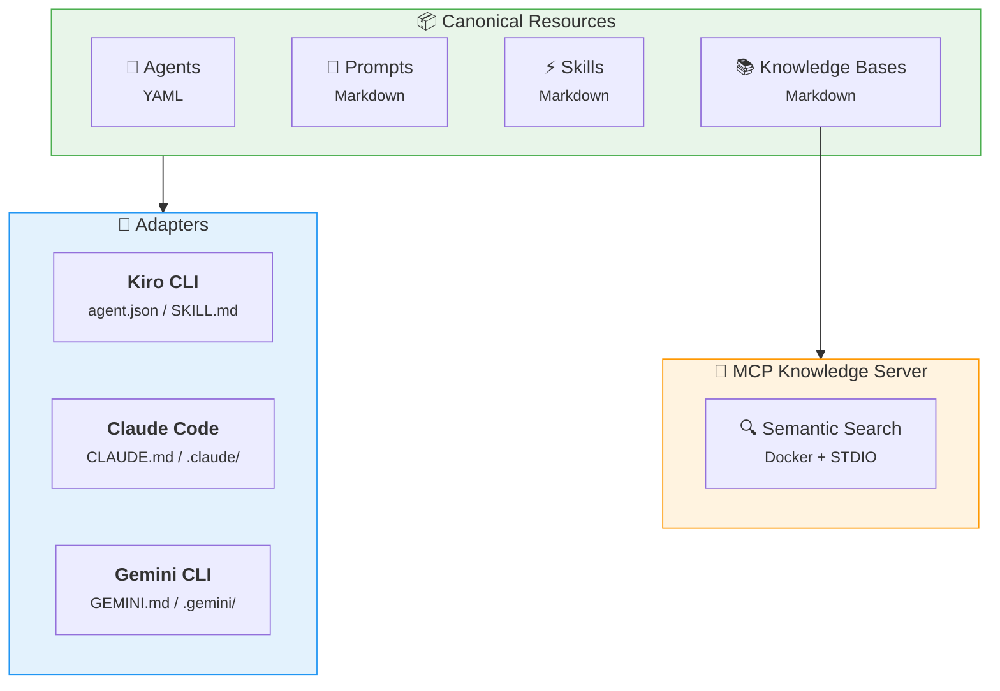

# Common AI Resources

!!! warning "Work in Progress"
    This project is under active development and not yet complete. APIs, configurations, and documentation may change without notice.

A centralized repository of AI assistant resources — agents, prompts, skills, and knowledge bases — designed to work across multiple AI tools.

## Why This Project?

AI assistants like Kiro CLI, Claude Code, and Gemini CLI each have their own configuration formats for the same underlying concepts: system prompts, workflows, and context documents. This leads to duplication and drift when you use multiple tools.

**Common AI Resources** solves this by:

1. Defining resources once in a **canonical, tool-agnostic format**
2. Using **adapters** to generate tool-specific configurations
3. Exposing knowledge bases via a **universal MCP server** that any compatible tool can query

## Architecture



## Key Concepts

### Resources

| Resource | Purpose | Format |
|----------|---------|--------|
| **Agents** | AI assistant persona definitions | YAML |
| **Prompts** | Reusable system prompts and templates | Markdown |
| **Skills** | Multi-step workflows and procedures | Markdown |
| **Knowledge Bases** | Reference documentation for RAG | Markdown |

### Adapters

Adapters transform canonical definitions into tool-specific configurations. Each adapter understands the target tool's format and generates the correct output files.

### MCP Server

A Docker-based MCP server that indexes all knowledge bases and exposes them via semantic search. This provides a universal way for any AI tool to access your documentation without loading entire files into context.

## Getting Started

```bash
# Clone the repository
git clone https://github.com/jlmonteiro/common-ai-resources.git
cd common-ai-resources

# Install in development mode
pip install -e ".[dev,docs]"

# Build the MCP knowledge base server
inv build

# Serve this documentation locally
inv docs
```

## Project Structure

```
common-ai-resources/
├── resources/
│   ├── agents/              # Canonical agent definitions
│   ├── prompts/             # Shared prompt templates
│   ├── skills/              # Workflow definitions
│   ├── knowledge-bases/     # Documentation for RAG
│   └── scripts/             # Utility scripts
├── src/common_ai/           # Python CLI + adapters
│   ├── cli.py               # CLI entry point
│   ├── mcp_server.py        # MCP knowledge server
│   └── adapters/            # Per-tool generators
├── tests/
├── docs/                    # This documentation
├── knowledge-base-mcp.dockerfile
├── tasks.py                 # Build tasks (invoke)
└── pyproject.toml
```
