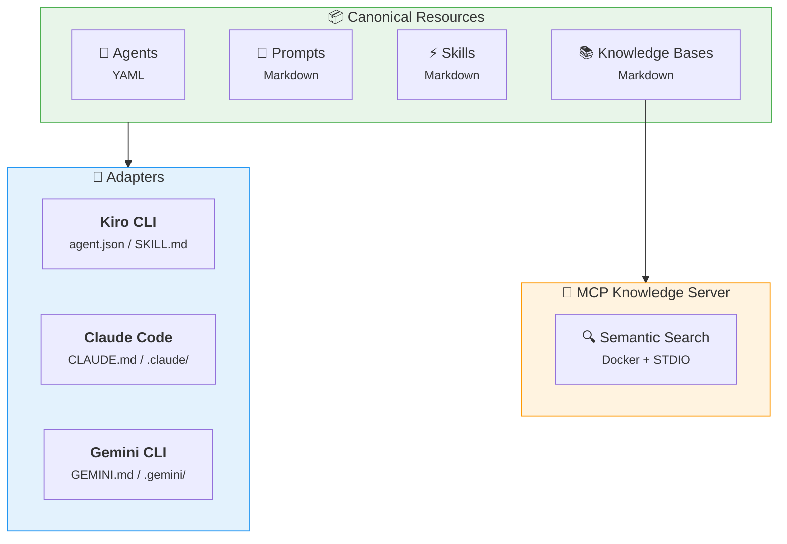

# Common AI Resources

A centralized repository of AI assistant resources — agents, prompts, skills, and knowledge bases — designed to work across multiple AI tools.

## :material-help-circle: Why This Project?

AI assistants like Kiro CLI, Claude Code, and Gemini CLI each have their own configuration formats for the same underlying concepts: system prompts, workflows, and context documents. This leads to duplication and drift when you use multiple tools.

**Common AI Resources** solves this by:

1. Defining resources once in a **canonical, tool-agnostic format**
2. Using **adapters** to generate tool-specific configurations
3. Exposing knowledge bases via a **universal MCP server** that any compatible tool can query

## :material-view-grid: What's Inside

<div class="grid cards" markdown>

- :material-robot:{ .lg .middle } **Agents**

    ---

    AI persona definitions in YAML. Adapters convert to tool-specific formats.

- :material-lightning-bolt:{ .lg .middle } **Skills**

    ---

    Multi-step workflows as Markdown. Reusable across tools and projects.

- :material-book-open-page-variant:{ .lg .middle } **Knowledge Bases**

    ---

    Reference documentation indexed for semantic search via MCP.

- :material-console:{ .lg .middle } **MCP Server**

    ---

    Docker-based semantic search. Any MCP-compatible tool can query.

</div>

## :material-sitemap: Architecture



## :material-rocket-launch: Getting Started

=== "Development Setup"

    ```bash
    git clone https://github.com/jlmonteiro/common-ai-resources.git
    cd common-ai-resources
    pip install -e ".[dev,docs]"
    ```

=== "Build MCP Server"

    ```bash
    inv build
    ```

=== "Serve Documentation"

    ```bash
    inv docs
    ```

## :material-folder-outline: Project Structure

```
common-ai-resources/
├── resources/
│   ├── agents/              # Canonical agent definitions
│   ├── prompts/             # Shared prompt templates
│   ├── skills/              # Workflow definitions
│   ├── knowledge-bases/     # Documentation for RAG
│   └── scripts/             # Utility scripts
├── src/common_ai/           # Python CLI + adapters
│   ├── cli.py               # CLI entry point
│   ├── mcp_server.py        # MCP knowledge server
│   └── adapters/            # Per-tool generators
├── tests/
├── docs/                    # This documentation
├── knowledge-base-mcp.dockerfile
├── tasks.py                 # Build tasks (invoke)
└── pyproject.toml
```

## :material-arrow-right-circle: Next Steps

- Explore the [Knowledge Bases](knowledge-bases/index.md) available for semantic search
- Learn how the [MCP Server](mcp-server.md) works and how to connect your AI tool
