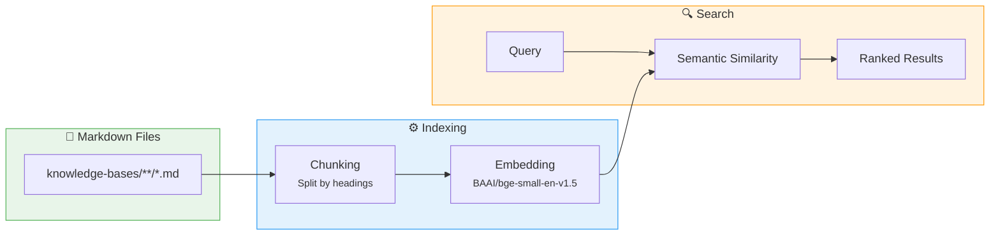

# :material-book-open-page-variant: Knowledge Bases

Knowledge bases are markdown documents that provide context to AI assistants via semantic search. They are the foundation of the RAG (Retrieval-Augmented Generation) strategy used by the MCP server.

## :material-format-list-bulleted: Available Topics

| Topic | Description |
|-------|-------------|
| :material-file-document-outline: [SDD](sdd.md) | Spec-Driven Development methodology, templates, and best practices |
| :material-docker: [Docker](docker.md) | Dockerfile standards and image management conventions |
| :material-database-outline: [Database](database.md) | Naming, migrations, and schema change conventions |
| :simple-gradle: [Gradle](gradle.md) | Kotlin DSL conventions and version management |
| :material-ship-wheel: [Helm](helm.md) | Chart conventions, NOTES.txt, probes, and environment injection |
| :material-kubernetes: [Kubernetes](k8s.md) | Resource dimensioning, scaling, security, namespaces, resilience |
| :simple-spring: [Java](java.md) | Coding standards, Spring Boot conventions, Lombok |
| :material-git: [Git](git.md) | Commit messages, branching, PRs, tagging, and pre-commit hooks |
| :material-shield-lock: [Security](security.md) | Auth patterns, secrets management, input validation, data protection |
| :material-chart-line: [Observability](observability.md) | Metrics (RED/USE), tracing, health checks, alerting, dashboards |
| :material-shield-refresh: [Resilience](resilience.md) | Circuit breaker, retry, timeout, bulkhead, fallback |
| :material-text-box-outline: [Logging](logging.md) | Structured JSON, levels, tracing context, audit, cloud-friendly |
| :material-test-tube: [Testing](testing.md) | TDD, BDD, test pyramid, mocking rules, Testcontainers |
| :material-api: [API](api.md) | REST standards, API First, status codes, pagination, versioning |

## :material-cog: How It Works

## :material-plus-circle: Adding a Knowledge Base

1. Create a new folder under `resources/knowledge-bases/`
2. Add markdown files with your documentation
3. Rebuild the MCP Docker image: `inv build`

!!! info
    The MCP server automatically indexes all `*.md` files recursively. No configuration needed.

## :material-check-all: Best Practices

!!! tip "Writing for RAG"
    Each chunk should make sense **in isolation** — the AI tool sees only the chunk, not the full file.

- Split large topics into multiple files (~200 lines max per file)
- Use `#`, `##`, `###` headings to create natural chunk boundaries
- Write self-contained sections with descriptive headings
- Headings become part of the search context (e.g., `Design > Security > Zero Trust`)
- Keep sections under 500 characters when possible for optimal search precision
