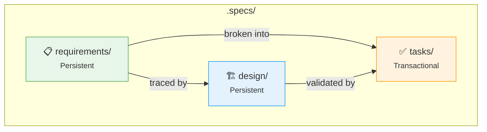

# Spec-Driven Development (SDD)

A methodology where specifications are created before implementation. Requirements and design are persistent artifacts that evolve across epics, while tasks are transactional artifacts scoped to a specific epic/story.

## Contents

| File | Description |
|------|-------------|
| `sdd.md` | Methodology overview, specification structure, and file templates |
| `requirements-best-practices.md` | Dos, don'ts, and quality checklist for writing requirements |
| `design-best-practices.md` | Design guidelines, ADR standards, and quality checklist |

## Key Concepts

- **EARS Pattern** — structured syntax for writing testable requirements
- **Persistent vs Transactional** — requirements/design grow over time; tasks are per-epic
- **ADRs** — evidence-based architectural decisions with alternatives and rationale
- **Traceability** — every requirement links to a test scenario and design decision

## Specification Structure

## Usage

This knowledge base is used by AI assistants to:

- Generate requirements following EARS syntax and best practices
- Create design documents with proper ADR structure
- Break down work into well-scoped user stories with estimates
- Maintain traceability across the specification lifecycle
