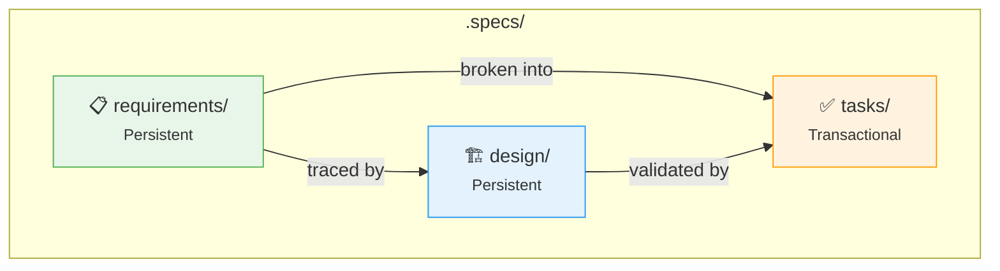

# :material-file-document-outline: Spec-Driven Development (SDD)

A methodology where specifications are created before implementation. Requirements and design are persistent artifacts that evolve across epics, while tasks are transactional artifacts scoped to a specific epic/story.

## :material-file-tree: Contents

| File | Description |
|------|-------------|
| [`sdd.md`](https://github.com/jlmonteiro/common-ai-resources/blob/main/resources/knowledge-bases/sdd/sdd.md) | Methodology overview, specification structure, and file templates |
| [`requirements-best-practices.md`](https://github.com/jlmonteiro/common-ai-resources/blob/main/resources/knowledge-bases/sdd/requirements-best-practices.md) | Dos, don'ts, and quality checklist for writing requirements |
| [`design-best-practices.md`](https://github.com/jlmonteiro/common-ai-resources/blob/main/resources/knowledge-bases/sdd/design-best-practices.md) | Design guidelines, ADR standards, and quality checklist |

## :material-key: Key Concepts

- :material-format-list-checks:{ .lg .middle } **EARS Pattern**

    ---

    Structured syntax for writing testable, unambiguous requirements.

- :material-swap-horizontal:{ .lg .middle } **Persistent vs Transactional**

    ---

    Requirements/design grow over time; tasks are created per-epic.

- :material-scale-balance:{ .lg .middle } **ADRs**

    ---

    Evidence-based architectural decisions with alternatives and rationale.

- :material-link-variant:{ .lg .middle } **Traceability**

    ---

    Every requirement links to a test scenario and design decision.

## :material-folder-outline: Specification Structure

## :material-robot: Usage

!!! info
    This knowledge base is used by AI assistants to generate specifications following industry best practices.

- Generate requirements following EARS syntax
- Create design documents with proper ADR structure
- Break down work into well-scoped user stories with hour estimates
- Maintain traceability across the specification lifecycle
