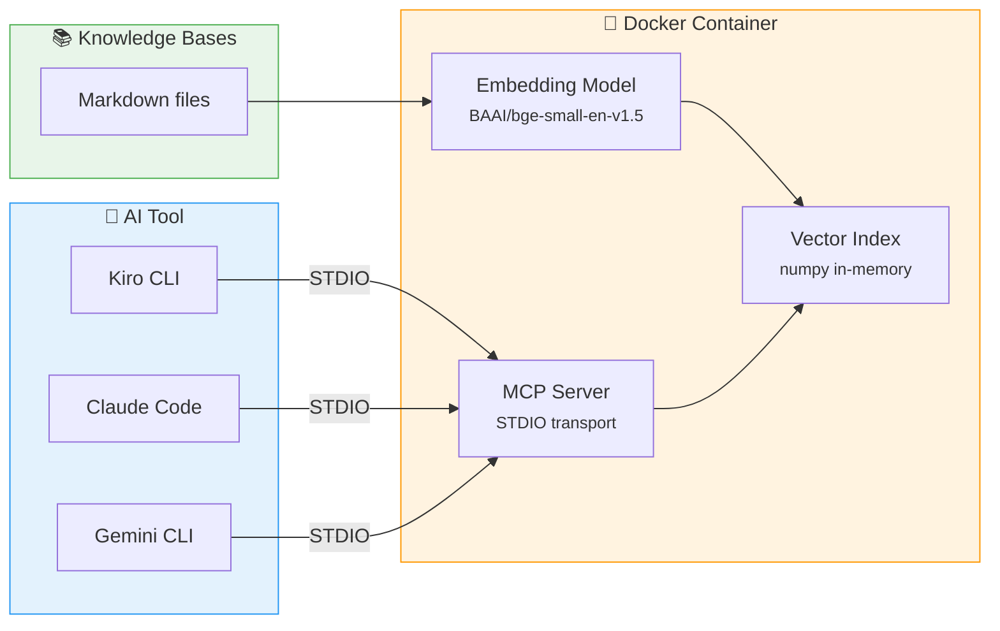

# :material-console: MCP Knowledge Server

A Docker-based [Model Context Protocol](https://modelcontextprotocol.io/) server that provides semantic search over all knowledge bases. Any MCP-compatible AI tool can connect and query your documentation.

## :material-scale-balance: Why MCP Instead of Context Files?

AI tools like Claude Code (`CLAUDE.md`) and Gemini (`GEMINI.md`) support loading context from files directly. So why add an MCP server?

| Aspect | Context Files | MCP Server |
|--------|--------------|------------|
| **Context usage** | Loads entire file into context window | Returns only relevant chunks |
| **Scalability** | Degrades as docs grow (token limits) | Handles hundreds of files efficiently |
| **Precision** | AI must scan full document | Semantic search finds exact sections |
| **Tool support** | Tool-specific format per file | Universal protocol, one server for all tools |
| **Maintenance** | Duplicate content per tool | Single source of truth |
| **Dynamic queries** | Static — loaded once at start | On-demand — query what you need, when you need it |

!!! tip "When to use each"
    Use **context files** for small, always-relevant instructions (project rules, coding style).
    Use the **MCP server** for large reference documentation that's queried selectively (knowledge bases, API docs, best practices).

## :material-sitemap: Architecture



## :material-wrench: Tools

The server exposes two MCP tools:

### :material-magnify: search_knowledge

Semantic search across all indexed knowledge bases.

| Parameter | Type | Required | Default | Description |
|-----------|------|----------|---------|-------------|
| `query` | string | :material-check: | — | The search query |
| `limit` | integer | :material-close: | 5 | Maximum results to return |

??? example "Example response"
    ```
    **[sdd/sdd.md]** (score: 0.792)

    ## EARS Pattern

    Requirements use the EARS (Easy Approach to Requirements Syntax) pattern...
    ```

### :material-format-list-bulleted: list_knowledge_bases

Lists all available knowledge base topics. No parameters required.

## :material-play-circle: Setup

### Build

```bash
inv build
```

### Client Configuration

!!! note
    The MCP server configuration is identical across tools — only the file location differs.

=== "Kiro CLI"

    Add to `~/.kiro/settings/mcp.json` (global) or `<project>/.kiro/settings/mcp.json` (project-scoped):

    ```json
    {
      "mcpServers": {
        "common-knowledge-base-mcp": {
          "command": "docker",
          "args": ["run", "-i", "ghcr.io/jlmonteiro/common-knowledge-base-mcp"]
        }
      }
    }
    ```

    ??? example "Advanced: auto-approve and timeout"
        Kiro supports extra parameters for fine-tuning agent interaction:

        ```json
        {
          "mcpServers": {
            "common-knowledge-base-mcp": {
              "command": "docker",
              "args": ["run", "-i", "ghcr.io/jlmonteiro/common-knowledge-base-mcp"],
              "timeout": 60000,
              "autoApprove": ["search_knowledge", "list_knowledge_bases"]
            }
          }
        }
        ```

    !!! tip "Verify connection"
        Run `/mcp` in a Kiro CLI session to check server status and which scope (global or project) it was loaded from.

=== "Claude Desktop"

    Add to `~/Library/Application Support/Claude/claude_desktop_config.json` (macOS):

    ```json
    {
      "mcpServers": {
        "common-knowledge-base-mcp": {
          "command": "/usr/local/bin/docker",
          "args": ["run", "-i", "ghcr.io/jlmonteiro/common-knowledge-base-mcp"]
        }
      }
    }
    ```

    !!! warning "Use absolute path for Docker"
        Claude Desktop runs with a minimal `$PATH`. Use the full path to Docker (`which docker` to find yours). On Apple Silicon/Homebrew it may be `/opt/homebrew/bin/docker`.

    !!! tip "Verify connection"
        Fully quit and relaunch Claude Desktop. Look for the plug/hammer icon at the bottom-right of the chat input — click it to confirm `common-ai-knowledge` is listed.

=== "Gemini CLI"

    Add to `~/.gemini/settings.json`:

    ```json
    {
      "mcpServers": {
        "common-knowledge-base-mcp": {
          "command": "docker",
          "args": ["run", "-i", "ghcr.io/jlmonteiro/common-knowledge-base-mcp"]
        }
      }
    }
    ```

    !!! tip "Verify connection"
        After restarting Gemini CLI, run `/mcp` to check the server status. You should see `🟢 common-ai-knowledge - Ready`.

### Development Mode

!!! info
    Mount your local knowledge bases for live changes without rebuilding the image.

```json
{
  "mcpServers": {
    "common-knowledge-base-mcp": {
      "command": "docker",
      "args": ["run", "-i", "-v", "./resources/knowledge-bases:/data", "ghcr.io/jlmonteiro/common-knowledge-base-mcp"]
    }
  }
}
```

## :material-tune: Configuration

| Environment Variable | Default | Description |
|---------------------|---------|-------------|
| `KB_PATH` | `/data` | Path to knowledge base files |
| `EMBEDDING_MODEL` | `BAAI/bge-small-en-v1.5` | Embedding model name |

## :material-information: Technical Details

| Component | Detail |
|-----------|--------|
| **Embedding model** | BAAI/bge-small-en-v1.5 (~50MB, ONNX runtime) |
| **Chunking** | Heading-aware (`#`, `##`, `###`) + recursive fallback |
| **Chunk size** | 500 chars, 100 char overlap |
| **Search** | Cosine similarity via numpy dot product |
| **Index lifecycle** | Built on first query, cached in memory |
| **Image size** | ~420 MB |
| **Heading context** | Each chunk includes its heading hierarchy |
