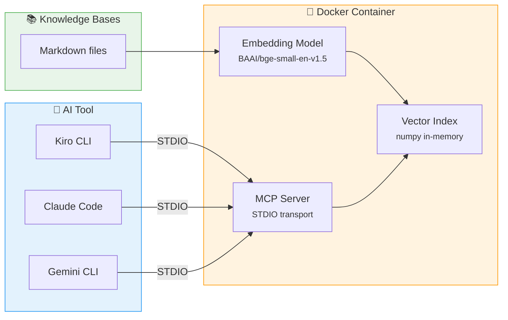

# MCP Knowledge Server

A Docker-based [Model Context Protocol](https://modelcontextprotocol.io/) server that provides semantic search over all knowledge bases. Any MCP-compatible AI tool can connect and query your documentation.

## Why MCP Instead of Context Files?

AI tools like Claude Code (`CLAUDE.md`) and Gemini (`GEMINI.md`) support loading context from files directly. So why add an MCP server?

| Aspect | Context Files | MCP Server |
|--------|--------------|------------|
| **Context usage** | Loads entire file into context window | Returns only relevant chunks |
| **Scalability** | Degrades as docs grow (token limits) | Handles hundreds of files efficiently |
| **Precision** | AI must scan full document | Semantic search finds exact sections |
| **Tool support** | Tool-specific format per file | Universal protocol, one server for all tools |
| **Maintenance** | Duplicate content per tool | Single source of truth |
| **Dynamic queries** | Static — loaded once at start | On-demand — query what you need, when you need it |

!!! tip "When to use each"
    Use **context files** for small, always-relevant instructions (project rules, coding style).
    Use the **MCP server** for large reference documentation that's queried selectively (knowledge bases, API docs, best practices).

## Architecture



## Tools

The server exposes two MCP tools:

### search_knowledge

Semantic search across all indexed knowledge bases.

| Parameter | Type | Required | Default | Description |
|-----------|------|----------|---------|-------------|
| `query` | string | yes | — | The search query |
| `limit` | integer | no | 5 | Maximum results to return |

**Example response:**

```
**[sdd/sdd.md]** (score: 0.792)

## EARS Pattern

Requirements use the EARS (Easy Approach to Requirements Syntax) pattern...
```

### list_knowledge_bases

Lists all available knowledge base topics.

## Setup

### Build

```bash
inv build
```

### Client Configuration

Add to your AI tool's MCP configuration:

```json
{
  "mcpServers": {
    "common-ai-knowledge": {
      "command": "docker",
      "args": ["run", "-i", "ghcr.io/jlmonteiro/common-knowledge-base-mcp"]
    }
  }
}
```

### Development Mode

Mount your local knowledge bases for live changes without rebuilding:

```json
{
  "mcpServers": {
    "common-ai-knowledge": {
      "command": "docker",
      "args": ["run", "-i", "-v", "./resources/knowledge-bases:/data", "ghcr.io/jlmonteiro/common-knowledge-base-mcp"]
    }
  }
}
```

## Configuration

| Environment Variable | Default | Description |
|---------------------|---------|-------------|
| `KB_PATH` | `/data` | Path to knowledge base files |
| `EMBEDDING_MODEL` | `BAAI/bge-small-en-v1.5` | Embedding model name |

## Technical Details

- **Embedding model**: BAAI/bge-small-en-v1.5 (~50MB, ONNX runtime)
- **Chunking strategy**: Heading-aware splitting (`#`, `##`, `###`) with recursive fallback at paragraph/sentence boundaries
- **Chunk size**: 500 chars with 100 char overlap
- **Search**: Cosine similarity via numpy dot product
- **Index**: Built on first query, cached in memory for session lifetime
- **Image size**: ~420 MB
- **Heading context**: Each chunk includes its heading hierarchy (e.g., `Design > ADRs > When to Write`)
