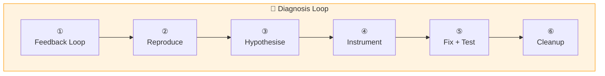

# :material-bug: Diagnose

A disciplined 6-phase methodology for debugging hard bugs and performance regressions. The skill enforces a structured approach — build a feedback loop, reproduce, hypothesise, instrument, fix, and verify — preventing the common trap of guessing at causes without evidence.

The key insight is Phase 1: if you have a fast, deterministic pass/fail signal for the bug, you will find the cause. Everything else is mechanical. The skill spends disproportionate effort on building that feedback loop before attempting any fix.

## Flow

!!! tip "Triggers"
    - "diagnose this" / "debug this" / "troubleshoot this"
    - Reports a bug or something broken/failing
    - Describes a performance regression

!!! success "Expected Outcomes"
    - Root cause identified with evidence
    - Regression test proving the fix
    - All debug instrumentation cleaned up
    - Post-mortem recommendation for prevention

## Phases

:material-numeric-1-circle:{ .lg } **Build a Feedback Loop**

> Spend disproportionate effort here. If you have a fast, deterministic pass/fail signal, you will find the cause.

Try in order: failing test → HTTP script → CLI invocation → replay trace → throwaway harness → fuzz loop → bisection → differential loop.

---

:material-numeric-2-circle:{ .lg } **Reproduce**

> Run the loop. Watch the bug appear. Confirm it matches what the user described.

---

:material-numeric-3-circle:{ .lg } **Hypothesise**

> Generate 3–5 ranked, falsifiable hypotheses before testing any.

---

:material-numeric-4-circle:{ .lg } **Instrument**

> One variable at a time. Tag debug logs with `[DEBUG-xxxx]` for easy cleanup.

---

:material-numeric-5-circle:{ .lg } **Fix + Regression Test**

> Write the test BEFORE the fix (TDD). Watch it fail, apply fix, watch it pass.

---

:material-numeric-6-circle:{ .lg } **Cleanup + Post-Mortem**

> Remove instrumentation, verify original repro is gone, document what would have prevented this.

## Example

!!! example "Scenario: /orders returns 500 for some users"

    **Phase 1:** Agent writes integration test, loops 100×, raises reproduction rate to 40%.

    **Phase 2:** Confirms `NullPointerException at OrderService.java:42`.

    **Phase 3:** Presents hypotheses:

    1. Race condition in user cache
    2. Users without `address` field → NPE
    3. Connection pool exhaustion
    4. Lazy loading outside transaction

    **Phase 4:** Tests #2: `[DEBUG-x7k2] User user-abc-123: address=null` — confirmed.

    **Phase 5:**

    1. Writes test: "should return orders when user has no address" → fails ❌
    2. Adds null check → passes ✅
    3. Original loop: 0 failures in 100 runs ✅

    **Phase 6:** Commit: `fix: handle null address in order retrieval`

    Recommendation: "Add @NotNull on user creation or make OrderService null-safe."

## Source

[:material-file-code: SKILL.md](https://github.com/jlmonteiro/common-ai-resources/blob/main/resources/skills/debugging/diagnose/SKILL.md)
