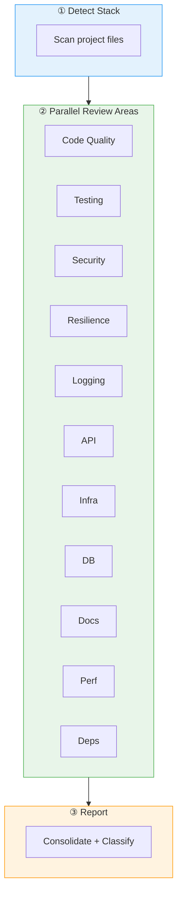

# :material-magnify: Code Review

A comprehensive code review that adapts to the project's tech stack. The skill detects the language, framework, and infrastructure from project files, then runs focused checks across 11 areas — each searching only the relevant knowledge base scopes for accurate, context-specific feedback.

When sub-agents are available (Kiro CLI, Claude Code), each review area runs in parallel with its own context. When not available, areas run sequentially. Either way, the output is a consolidated report with severity-classified findings referencing specific standards.

## Flow



!!! tip "Triggers"
    - "review code" / "code review"
    - "check code quality"
    - "review this PR" / "review my changes"

!!! success "Expected Outcomes"
    - Findings classified: 🔴 Critical | 🟡 High | 🟢 Medium | ℹ️ Info
    - Each finding references the specific KB standard violated
    - Offer to fix in priority order

## Review Areas

<div class="grid cards" markdown>

- :material-code-braces: **Code Quality** — naming, complexity, patterns
- :material-test-tube: **Testing** — coverage, BDD, negative scenarios
- :material-shield-lock: **Security** — validation, secrets, injection
- :material-shield-refresh: **Resilience** — error handling, retries, fallbacks
- :material-text-box-outline: **Logging** — structured, levels, no sensitive data
- :material-api: **API** — REST conventions, status codes, compatibility
- :material-docker: **Infrastructure** — Dockerfile, Helm, K8s
- :material-database: **Database** — naming, migrations, patterns
- :material-file-document: **Documentation** — README, API docs, comments
- :material-speedometer: **Performance** — N+1, caching, unbounded collections
- :material-package-variant: **Dependencies** — pinned, no vulnerabilities

</div>

## Example

!!! example "Scenario: Review a Spring Boot PR with Docker and Helm changes"

    **① Detection:** Java, Gradle, Spring Boot, Docker, Helm detected.

    Scopes: `java`, `gradle`, `docker`, `helm`, `testing`, `security`, `resilience`, `logging`, `observability`, `api`

    **② Review:** 11 focused checks run (parallel or sequential).

    **③ Report:**

    ```
    Files reviewed: 5
    Findings: 🔴 1 Critical | 🟡 3 High | 🟢 2 Medium | ℹ️ 1 Info

    🔴 [Security] Missing input validation on OrderRequest
       Standard: annotation-based validation (security KB)
       Fix: Add @NotNull, @Size, @Valid

    🟡 [Testing] No negative test for invalid order
       Standard: at least one negative per happy path (testing KB)

    🟡 [Logging] OrderService missing @Observed
       Standard: custom metrics for key operations (observability KB)

    🟡 [Resilience] No circuit breaker for payment call
       Standard: define fallback for external deps (resilience KB)
    ```

    Agent: "Would you like me to fix these? Critical issues first."

## Source

[:material-file-code: SKILL.md](https://github.com/jlmonteiro/common-ai-resources/blob/main/resources/skills/development/code-review/SKILL.md)
