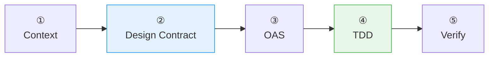

# :material-api: Create API Endpoint

API First — designs the OpenAPI contract, gets approval, then implements with TDD.

## Flow



!!! tip "Triggers"
    - "add endpoint" / "create API" / "add a route" / "new endpoint"

!!! success "Expected Outcomes"
    - OAS updated, controller + service + DTOs created
    - Tests: happy path + validation error (minimum)
    - Implementation verified against contract

## Example

!!! example "Scenario: Add POST /api/v1/orders"

    **Step 1 — Gather Context:**

    > "What resource?" → Orders
    > "What operation?" → Create
    > "Constraints?" → Must validate items, check customer exists

    **Step 2 — Design Contract:**

    Agent proposes:

    ```
    POST /api/v1/orders

    Request:
      { "customerId": "string", "items": [...], "shippingAddress": {...} }

    Responses:
      201: Created order (returns full resource with id, status, total)
      400: Invalid request format
      422: Validation failed (ProblemDetail with errors array)
      401: Unauthorized

    Does this look correct?
    ```

    User: "Add a 409 for duplicate idempotency key"

    Agent updates proposal. User confirms.

    **Step 3 — OAS:** Adds to `openapi.yaml` with schemas, examples, all 5 response codes.

    **Step 4 — TDD:**

    1. Writes test: "should create order with valid input" → fails ❌
    2. Implements controller + service + DTOs → passes ✅
    3. Writes test: "should return 422 for empty items" → fails ❌
    4. Adds @Valid + @NotEmpty → passes ✅
    5. Writes test: "should return 409 for duplicate idempotency key" → fails ❌
    6. Adds idempotency check → passes ✅

    **Step 5 — Verify:** All responses match OAS definition ✅

## Source

[:material-file-code: SKILL.md](https://github.com/jlmonteiro/common-ai-resources/blob/main/resources/skills/development/create-api-endpoint/SKILL.md)
