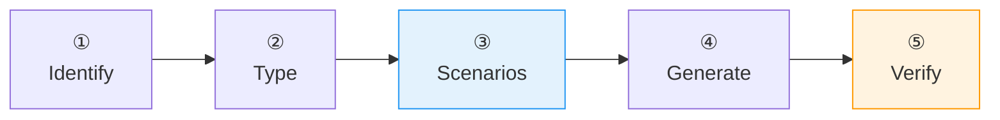

# :material-test-tube: Create Test

Auto-detects test type, proposes scenarios, generates BDD-structured tests. Catches real bugs.

## Flow



!!! tip "Triggers"
    - "create test" / "generate tests" / "write tests" / "add tests" / "test this class"

!!! success "Expected Outcomes"
    - BDD tests (Given/When/Then) with happy path + negative scenarios
    - Coverage report with gaps identified
    - Bugs found reported

## Example

!!! example "Scenario: Test OrderService"

    **Step 2 — Determine Type:**

    > "This service has:
    > - OrderRepository (database) → Testcontainers PostgreSQL
    > - PaymentGateway (external HTTP) → Mock
    > - NotificationService (internal) → Real bean
    >
    > Integration test with @SpringBootTest. OK?"

    User: "Yes"

    **Step 3 — Propose Scenarios:**

    > **createOrder():**
    >
    > 1. ✅ Should create order with valid items and charge payment
    > 2. ✅ Should send notification after successful creation
    > 3. ❌ Should reject order with empty items list
    > 4. ❌ Should reject order when customer not found
    > 5. ❌ Should rollback when payment gateway times out
    > 6. ❌ Should rollback when payment is declined
    >
    > **cancelOrder():**
    >
    > 7. ✅ Should cancel order and refund payment
    > 8. ❌ Should reject cancellation of already-shipped order
    > 9. ❌ Should handle refund failure gracefully
    >
    > **getOrderStatus():**
    >
    > 10. ✅ Should return status for existing order
    > 11. ❌ Should return 404 for non-existent order
    >
    > Add or remove any?

    User: "Add concurrent idempotency key test"

    Agent adds: 12. ❌ Should return existing order for duplicate idempotency key

    **Step 4 — Generate:**

    ```groovy
    @Title("Order Service")
    @Narrative("Handles order creation, cancellation, and status")
    @SpringBootTest
    @Testcontainers
    class OrderServiceSpec extends Specification {

        @MockitoBean
        PaymentGateway paymentGateway

        def "should reject order with empty items list"() {
            given: "a request with no items"
                def request = new CreateOrderRequest(
                    customerId: "cust-123", items: [])

            when: "order creation is attempted"
                orderService.createOrder(request)

            then: "validation exception is thrown"
                thrown(ValidationException)

            and: "nothing is persisted"
                orderRepository.count() == 0
        }
    }
    ```

    **Step 5 — Run:**

    > "should reject empty items" — FAILED ❌
    > The service doesn't validate empty items. This is a bug.
    > Want me to fix it?

## Source

[:material-file-code: SKILL.md](https://github.com/jlmonteiro/common-ai-resources/blob/main/resources/skills/development/create-test/SKILL.md)
