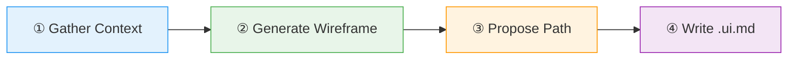

# :material-palette-swatch: Create UI Mockup

Generate low-fidelity wireframes using the Markdown-UI DSL. Produces `.ui.md` files with text-based UI specs that can later be synced to framework code.

> Based on [markdown-ui-dsl](https://github.com/MegaByteMark/markdown-ui-dsl) by MegaByteMark — MIT License.
> Original skill: [SKILL.md](https://github.com/MegaByteMark/markdown-ui-dsl/blob/main/skills/markdown-ui-dsl/SKILL.md)

## Flow



!!! tip "Triggers"
    - "create mockup" / "create wireframe"
    - "design UI" / "create ui spec"
    - "add screen" / "wireframe this"

!!! success "Expected Outcomes"
    - A `.ui.md` file using strict DSL syntax
    - Optional YAML frontmatter linking to framework and component
    - Placed in `wireframes/` directory by convention

## Example

!!! example "Scenario: Create a login form wireframe"

    **User:** "Create a wireframe for a login page, React + Tailwind"

    **① Context:** Login page, React + TailwindCSS, needs email/password fields + submit

    **② Output:**

    ```markdown
    ---
    framework: React + TailwindCSS
    component: src/components/LoginForm.tsx
    ---

    ::: CARD :::

    ## Login

    [ text: Email address ]
    [ text: Password ]

    > align right
    [ Log In ](#login)

    ***

    Don't have an account? [ Sign Up ](#signup)

    --- END ---
    ```

    **③ Path:** `wireframes/login-form.ui.md`

## Source

[:material-file-code: SKILL.md](https://github.com/jlmonteiro/common-ai-resources/blob/main/resources/skills/development/create-ui-mockup/SKILL.md)
