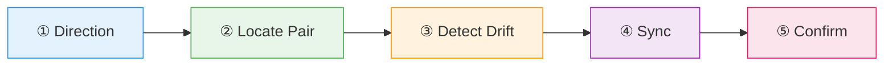

# :material-sync: Sync UI Spec

Two-way synchronization between `.ui.md` wireframes and framework component code. Detects drift and resolves conflicts with user confirmation.

> Based on [markdown-ui-dsl](https://github.com/MegaByteMark/markdown-ui-dsl) by MegaByteMark — MIT License.
> Original skill: [SKILL.md](https://github.com/MegaByteMark/markdown-ui-dsl/blob/main/skills/markdown-ui-dsl/SKILL.md)

## Flow



!!! tip "Triggers"
    - "sync ui" / "update wireframe"
    - "sync spec to code" / "sync code to spec"
    - "generate code from wireframe" / "translate ui spec"

!!! success "Expected Outcomes"
    - Wireframe and code in sync
    - `// UI Spec: <path>` header in generated code
    - Drift detected and resolved with user consent

## Sync Directions

<div class="grid cards" markdown>

- :material-arrow-right:{ .lg .middle } **Spec → Code**

    ---

    `.ui.md` is master. Generates/updates the component at the path defined in `component:` frontmatter.

- :material-arrow-left:{ .lg .middle } **Code → Spec**

    ---

    Component is master. Updates the `.ui.md` found via `// UI Spec:` comment header.

</div>

!!! warning "Safety"
    Always asks for confirmation before overwriting files unless user explicitly requests autonomous/force sync mode.

## Example

!!! example "Scenario: Generate React component from wireframe"

    **User:** "sync spec to code for wireframes/login-form.ui.md"

    **① Direction:** Spec → Code

    **② Pair:** Reads `component: src/components/LoginForm.tsx` from frontmatter

    **③ Drift:** File doesn't exist yet — will create

    **④ Sync:** Maps DSL to React + Tailwind components

    **⑤ Confirm:** Shows generated code, asks user to approve

    ```
    ✓ Synced: wireframes/login-form.ui.md → src/components/LoginForm.tsx

    Changes applied:
      - Created LoginForm component with Card, inputs, button

    Files created:
      - src/components/LoginForm.tsx
    ```

## Source

[:material-file-code: SKILL.md](https://github.com/jlmonteiro/common-ai-resources/blob/main/resources/skills/development/sync-ui-spec/SKILL.md)
