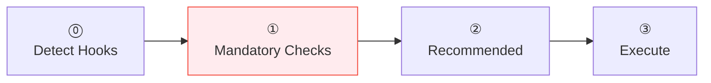

# :material-check-circle: Commit

Commits changes with pre-commit sanity checks. Detects existing hooks to avoid redundant validation, offers to set up hooks if missing.

## Flow

!!! tip "Triggers"
    - "commit" / "save changes" / "commit this" / "stage and commit"

!!! success "Expected Outcomes"
    - All mandatory checks pass (secrets, message, changelog, branch)
    - Commit created with conventional commit message

## Example

!!! example "Scenario: Committing a new feature"

    **Step 0:** `.pre-commit-config.yaml` found → secrets, lint, message, branch automated.

    **Step 1:**

    - 1.1 Secrets: ✅ (hook)
    - 1.2 Message format: ✅ (hook)
    - 1.3 Changelog: commit type is `feat` → checks CHANGELOG → missing entry:

    > "This is a feat commit but CHANGELOG.md has no entry. Let me add one."
    >
    > Adds: `- Docker knowledge base (Dockerfile standards, image management)`

    - 1.4 Branch: ✅ on `feature/add-kbs`

    **Step 2:**

    - 2.5 Docs impact: ⚠️ "New KB added but not in mkdocs.yml nav. Update?"

    User: "Yes" → agent adds to nav.

    **Step 3:** Stages specific files, commits:

    `feat(docker): add Dockerfile standards KB`

    All hooks pass ✅.

    **Step 4:** "This is a release-worthy change. Push when ready."

## Source

[:material-file-code: SKILL.md](https://github.com/jlmonteiro/common-ai-resources/blob/main/resources/skills/git/commit/SKILL.md)
