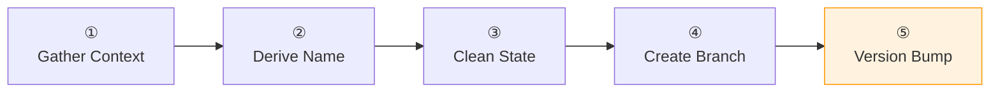

# :material-source-branch: Create Branch

Creates a new branch before starting work. Asks for context to determine proper naming and optionally bumps the version based on branch type.

## Flow

!!! tip "Triggers"
    - "create branch" / "start branch" / "new branch"
    - "start working on" / "begin feature"

!!! success "Expected Outcomes"
    - Branch created with proper naming (`<type>/<description>`)
    - Version bumped if applicable (feature→MINOR, fix→PATCH)
    - Changelog section created for new version

## Example

!!! example "Scenario: Starting a new feature"

    **Agent:** "What type?" → "feature". "Description?" → "add Docker KB"

    Suggests `feature/docker-knowledge-base` — confirmed.

    "Current version 0.2.0. Bump to 0.3.0?" → Yes.

## Source

[:material-file-code: SKILL.md](https://github.com/jlmonteiro/common-ai-resources/blob/main/resources/skills/git/create-branch/SKILL.md)
