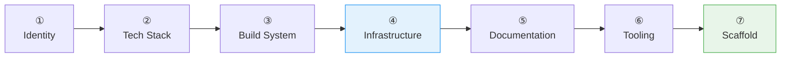

# :material-folder-plus: Create Project

Interactive project scaffolding. Asks about every decision — language, framework, Docker, Helm, CI/CD, docs, tooling. Never assumes.

## Flow



!!! tip "Triggers"
    - "create project" / "new project" / "scaffold project" / "init project"

!!! success "Expected Outcomes"
    - Complete project structure (build, source, tests, infra, docs)
    - Dotfiles (.editorconfig, .gitignore, .gitattributes)
    - project-context.md for AI agents
    - Git initialized with first commit

## Example

!!! example "Scenario: Multi-module Java project"

    **Step 1:** "order-management", "Microservice for orders", Jorge Monteiro, Apache 2.0

    **Step 2:** Java, Spring Boot, multi-module (api + worker). Gradle confirmed.

    **Step 3:** Creates `build.gradle.kts`, `settings.gradle.kts`, `gradle/libs.versions.toml` with bundles.

    **Step 4:**
    > "Docker?" → Yes
    > "Kubernetes?" → Yes, Helm chart
    > "CI/CD?" → GitHub Actions
    > "Database?" → PostgreSQL

    **Step 5:** MkDocs Material + Changelog

    **Step 6:** Pre-commit ✅, Checkstyle ✅, JaCoCo ✅

    **Step 7-8:** Scaffolds 20+ files, `git init`, first commit.

    **Step 9:**
    ```
    ✓ Project created: order-management

    Build: Gradle (Kotlin DSL, version catalog)
    Language: Java 21 / Spring Boot
    Modules: api, worker, deployment
    Infrastructure: Docker, Helm, GitHub Actions, PostgreSQL
    Documentation: MkDocs Material
    Tooling: pre-commit, checkstyle, JaCoCo

    Next steps:
    - Review project-context.md
    - Run 'create requirements' to start specifying features
    ```

## Source

[:material-file-code: SKILL.md](https://github.com/jlmonteiro/common-ai-resources/blob/main/resources/skills/project/create-project/SKILL.md)
