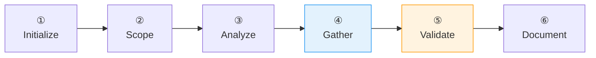

# :material-format-list-checks: Create Requirements

Gathers and documents requirements using EARS syntax. Interactive — asks focused questions, validates understanding, documents only after confirmation.

## Flow



!!! tip "Triggers"
    - "create requirements" / "start specification" / "add requirements"
    - "gather requirements" / "what do we need to build"

!!! success "Expected Outcomes"
    - Requirements with EARS syntax and rationale
    - Index updated with IDs and links
    - Quality checklist validated

## Example

!!! example "Scenario: Notification service"

    Asks (3 per turn): problem, channels, triggers. Then: failure scenarios, constraints.

    Summarizes: "Email + push, retry 3×, rate limit 10/hour, quiet hours. Correct?"

    Creates `.specs/requirements/notifications.md`:

    ```markdown
    # Requirements: Notifications

    ## 1. Functional Requirements

    ### FR-1: Order Event Notifications

    **Acceptance Criteria:**

    1. When an order status changes to "shipped", the system shall
       send a notification to the customer via their preferred channel.
    2. The system shall support email and push notification channels.
    3. If delivery fails, the system shall retry up to 3 times
       with exponential backoff.

    **Rationale:** So that customers stay informed about their orders
    without checking manually.

    ## 2. Non-Functional Requirements

    ### NFR-1: Rate Limiting

    **Acceptance Criteria:**

    1. The system shall not send more than 10 notifications per user
       per hour.
    2. If the limit is exceeded, the system shall queue notifications
       for the next available window.

    **Rationale:** So that users are not overwhelmed with notifications.
    ```

## Source

[:material-file-code: SKILL.md](https://github.com/jlmonteiro/common-ai-resources/blob/main/resources/skills/sdd/create-requirements/SKILL.md)
