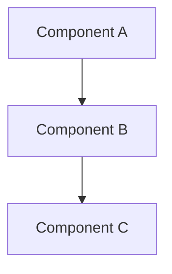

# Spec-Driven Development (SDD)

## Overview

Spec-Driven Development (SDD) is a methodology where specifications are created before implementation. Requirements and design are **persistent** artifacts that evolve across epics, while tasks are **transactional** artifacts scoped to a specific epic/story.

## Specification Structure

### Location

All specifications are stored in `.specs/` with three top-level folders:

```
project-root/
├── .specs/
│   ├── requirements/
│   │   ├── requirements.md          # Index: lists all requirements with IDs, titles, and links
│   │   ├── authentication.md        # Detailed requirements for authentication
│   │   ├── payment-processing.md    # Detailed requirements for payments
│   │   └── notifications.md         # Detailed requirements for notifications
│   ├── design/
│   │   ├── design.md                # Index: architecture overview with links to detail pages
│   │   ├── rest-architecture.md     # REST API design details
│   │   ├── security.md              # Security architecture
│   │   ├── data-models.md           # Data model definitions
│   │   └── test-scenarios.md        # Persistent test scenarios validating requirements
│   └── tasks/
│       ├── tasks.md                 # Index: lists all epics/stories with links
│       ├── 1-user-authentication.tasks.md
│       └── 2-payment-integration.tasks.md
```

### Persistent vs Transactional

| Aspect        | Requirements & Design              | Tasks                                |
|---------------|------------------------------------|--------------------------------------|
| **Type**      | Persistent                         | Transactional                        |
| **Scope**     | Entire project                     | Single epic/story                    |
| **Lifecycle** | Updated incrementally across epics | Created per epic, archived when done |
| **Files**     | Grow over time with new sections   | New file per epic                    |

### Index Files

Each folder has a main index file that acts as a table of contents:

- `requirements/requirements.md` — Lists every requirement by ID and title, linking to detail pages
- `design/design.md` — Provides architecture overview, linking to detail pages
- `tasks/tasks.md` — Lists all epics with status and links to their task breakdowns

## File Templates

### requirements/requirements.md (Index)

```markdown
# Requirements Index

## Overview

Brief description of the project and what this requirements index covers.

**The North Star:** One-sentence vision statement for the project.

**Stakeholders:**
- **End Users:** Who uses the system
- **Developers:** Who builds and maintains it
- **Admins:** Who operates it

---

## Requirement Classifications

All specifications are categorized into three types:

- **User Journeys (UJ):** Narrative-driven scenarios describing an end-to-end goal from the user's perspective.
- **Functional Requirements (FR):** Specific features or behaviors the system MUST perform.
- **Non-Functional Requirements (NFR):** Quality attributes such as performance, security, and reliability.

---

## EARS Pattern

Requirements use the **EARS (Easy Approach to Requirements Syntax)** pattern:

- **Ubiquitous:** "The system shall..." (Always true)
- **Event-driven:** "When <trigger>, the system shall..."
- **Unwanted Behavior:** "If <condition>, then the system shall..."
- **State-driven:** "While <state>, the system shall..."
- **Optional:** "Where <feature exists>, the system shall..."
- **Complex:** Combinations of the above triggers.

[EARS Documentation](https://alistairmavin.com/ears/)

---

## 1. User Journeys

| ID | Journey | Description |
| :--- | :--- | :--- |
| [**UJ-1**](auth-profile.md#uj-1) | Onboarding | First-time login and profile setup. |
| [**UJ-2**](auth-profile.md#uj-2) | Returning User | Seamless session restoration for existing users. |

---

## 2. {Module Name}

| ID | Requirement | Description |
| :--- | :--- | :--- |
| [**FR-1**](auth-profile.md#fr-1) | OAuth2 Auth | Secure login via identity provider. |
| [**FR-2**](auth-profile.md#fr-2) | Auto Registration | Seamless onboarding for new users. |
| [**NFR-1**](auth-profile.md#nfr-1) | Zero Trust | Mandatory session validation for all APIs. |

---

## N. Assumptions

| # | Assumption | Detail |
|---|-----------|--------|
| [**AS-1**]({topic}.md#as-1) | {Assumption title} | {Brief description} |
| [**AS-2**]({topic}.md#as-2) | {Assumption title} | {Brief description} |

---

## N+1. Out of Scope

| # | Item | Detail |
|---|------|--------|
| [**OOS-1**]({topic}.md#oos-1) | {Item title} | {Brief description} |
| [**OOS-2**]({topic}.md#oos-2) | {Item title} | {Brief description} |

---

## N+2. Glossary

| Term | Definition |
| :--- | :--- |
| **Term 1** | Definition of the term. |
| **Term 2** | Definition of the term. |
```

### requirements/{topic}.md (Detail Page)

```markdown
# Requirements: {Topic Name}

## 1. User Journeys

### UJ-{N}: {Journey Title}

1. User navigates to the application and is presented with {initial state}.
2. User performs {action}.
3. **The system SHALL** {expected behavior}.
4. **The system SHALL** {follow-up behavior}.
5. User is redirected to {outcome}.

---

## 2. Functional Requirements

### FR-{N}: {Requirement Title}

**Acceptance Criteria:**

1. When the user initiates {action}, the system shall {behavior}.
2. The system shall {behavior}.
3. If {condition}, then the system shall {fallback behavior}.

**Rationale:** So that {benefit}, I want to {goal}.

---

## 3. Non-Functional Requirements

### NFR-{N}: {Requirement Title}

**Acceptance Criteria:**

1. If {condition}, then the system shall {behavior}.
2. The system shall {behavior}.

**Rationale:** So that {benefit}, the system must {constraint}.

---

## 4. Assumptions

### AS-{N}: {Assumption Title}

**Statement:** {What is assumed to be true.}

**Impact if Wrong:** {What changes if this assumption doesn't hold.}

---

## 5. Out of Scope

### OOS-{N}: {Item Title}

**Description:** {Feature or capability explicitly excluded.}

**Rationale:** {Why it's out of scope.}
```

### design/design.md (Index)

```markdown
# Design Index

## Architecture Overview

Brief description of the overall system architecture.

## Pages

| Page | Description |
|------|-------------|
| [rest-architecture.md](rest-architecture.md) | REST API design and endpoints |
| [security.md](security.md) | Authentication, authorization, encryption |
| [data-models.md](data-models.md) | Database schemas and data structures |
| [test-scenarios.md](test-scenarios.md) | Test scenarios validating requirements |

## Component Interaction



## Key Design Decisions

| Decision | Rationale | Date |
|----------|-----------|------|
| Decision 1 | Why this approach | {date} |

## Architectural Decision Records (ADRs)

| ID | Decision | Status | Page |
|----|----------|--------|------|
| [**ADR-1**]({topic}.md#adr-1) | {Decision Title} | Accepted | [{topic}.md]({topic}.md) |
| [**ADR-2**]({topic}.md#adr-2) | {Decision Title} | Proposed | [{topic}.md]({topic}.md) |
```

### design/{topic}.md (Detail Page)

```markdown
# {Topic}

## Overview

Brief description of this design area.

## Components

### Component Name

**Purpose**: What this component does
**Technology**: Tech stack used

**Interfaces**:
- API endpoints
- Events published/consumed

**Configuration**:
- Environment variables
- Configuration files

## Architectural Decision Records

### ADR-{N}: {Decision Title}

**Status:** {Proposed | Accepted | Deprecated | Superseded}

**Problem:** {Technical problem or challenge that needs to be solved. What constraint, limitation, or requirement drives this decision?}

**Solution:** {The chosen approach and how it addresses the problem.}

**Alternatives Considered:**

| Alternative | Pros | Cons |
|-------------|------|------|
| {Option A} | {Benefits} | {Drawbacks} |
| {Option B} | {Benefits} | {Drawbacks} |
| {Option C} | {Benefits} | {Drawbacks} |

**Rationale:** {Why the chosen solution was selected over alternatives. Include evidence: benchmarks, PoC results, load test data, compatibility findings, or references to technical evaluations performed during the decision process.}

**Consequences:** {Technical trade-offs introduced. What becomes easier or harder? What new constraints does this impose on the system?}

## Error Handling

- **Input validation**: How invalid inputs are handled
- **External service failures**: Retry logic, fallbacks
- **Logging**: What gets logged and at what level
```

### design/test-scenarios.md (Persistent)

```markdown
# Test Scenarios

## {Module/Feature Name}

### TS-{N}: {Scenario Title}
- **Given**: {Initial state or context}.
- **When**: {Action or event}.
- **Then**: {Expected outcome}.

**Validates:**
- [FR-{N}: {Requirement Title}](../requirements/{topic}.md#fr-{n})

---

## Summary & Environment

- **Test Framework:** {Framework and version}
- **Database:** {Test database setup}
- **Mocks:** {External services mocked for deterministic testing}
- **Verification:** {Coverage and pass criteria}
```

### tasks/tasks.md (Index)

```markdown
# Tasks Index

## Epics

| # | Epic | Title | Status | Stories |
|---|------|-------|--------|---------|
| [1](1-user-authentication.tasks.md) | EPIC-123 | User Authentication | In Progress | 4 |
| [2](2-payment-integration.tasks.md) | EPIC-456 | Payment Integration | Draft | 3 |
```

### tasks/{id}-{slug}.tasks.md (Per-Epic)

**Naming:** `<sequential-id>-<title-slug>.tasks.md`
- ID is a sequential number (1, 2, 3, ...)
- Slug is lowercase, hyphenated, max 50 chars
- Examples: `1-user-authentication.tasks.md`, `2-payment-integration.tasks.md`

```markdown
# Tasks: {Title}

## Epic
- **Epic ID**: {EPIC-ID}
- **Status**: {Draft | In Progress | Done}

## References

| ID | Name |
|-----|------|
| [FR-{N}](../requirements/{topic}.md#fr-{n}) | {Requirement Title} |
| [NFR-{N}](../requirements/{topic}.md#nfr-{n}) | {Requirement Title} |
| [UJ-{N}](../requirements/{topic}.md#uj-{n}) | {Journey Title} |
| [ADR-{N}](../design/design.md#adr-{n}) | {Decision Title} |

## User Stories

### Story 1: {Title}
- **Story ID**: {STORY-ID}
- **Estimate**: {Hours}
- **Description**: What the story delivers
- **Dependencies**: {Story IDs or "None"}
- **Acceptance Criteria**:
  - [ ] Criterion 1
  - [ ] Criterion 2

## Story Breakdown Guidelines
- Each story should have a time estimate in hours (1-40 hours typical)
- Stories should be independently reviewable
- Each story must include implementation AND tests
- First story must establish CI/CD foundation
- Include documentation in each story
```

## Issue Tracker Integration

The tasks file references issue tracker identifiers (Epic IDs, Story IDs) that map to your team's tool of choice — whether that's GitHub Issues, GitLab Issues, Jira, Linear, or any other tracker.

The agent uses the appropriate issue tracker based on project configuration and available credentials.

## Effort Estimation

- Estimates in hours (1-40 hours per story)
- Include implementation, testing, and documentation time
- Story points are NOT set by the agent — defined by team during refinement
- Time format: `1h`, `4h`, `16h`

## Best Practices

### Persistent Files (Requirements & Design)

- Use consistent requirement IDs (REQ-001, REQ-002, ...)
- Tag each requirement with the epic that introduced it
- Keep index files up to date after every change
- Split into topic pages when a file exceeds ~200 lines
- Link between requirements and design sections
- When an item is replaced, mark it as **Superseded by [XX-N]({link})** — never delete, preserve history

### Transactional Files (Tasks)

- One file per epic under `tasks/` named `{id}-{slug}.tasks.md`
- Sequential IDs (1, 2, 3, ...)
- Reference requirement IDs in stories
- Each story must include implementation AND tests
- First story establishes CI/CD foundation
- Mark completed task files with status Done

### General

- Start with clear, measurable requirements
- Use INVEST criteria for stories
- Keep specifications focused and scoped
- Update persistent docs as the project evolves
